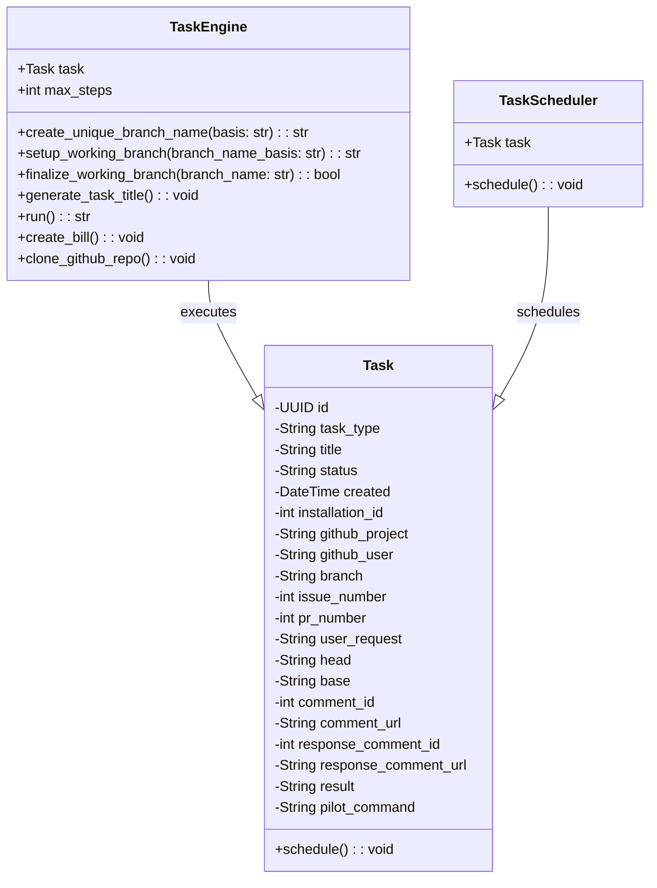

This diagram visualizes the relationship between `TaskEngine`, `Task`, and `TaskScheduler` within the PR Pilot project. `TaskEngine` is responsible for executing tasks, while `TaskScheduler` is responsible for scheduling them. `Task` acts as the central entity that is executed by the `TaskEngine` and scheduled by the `TaskScheduler`.